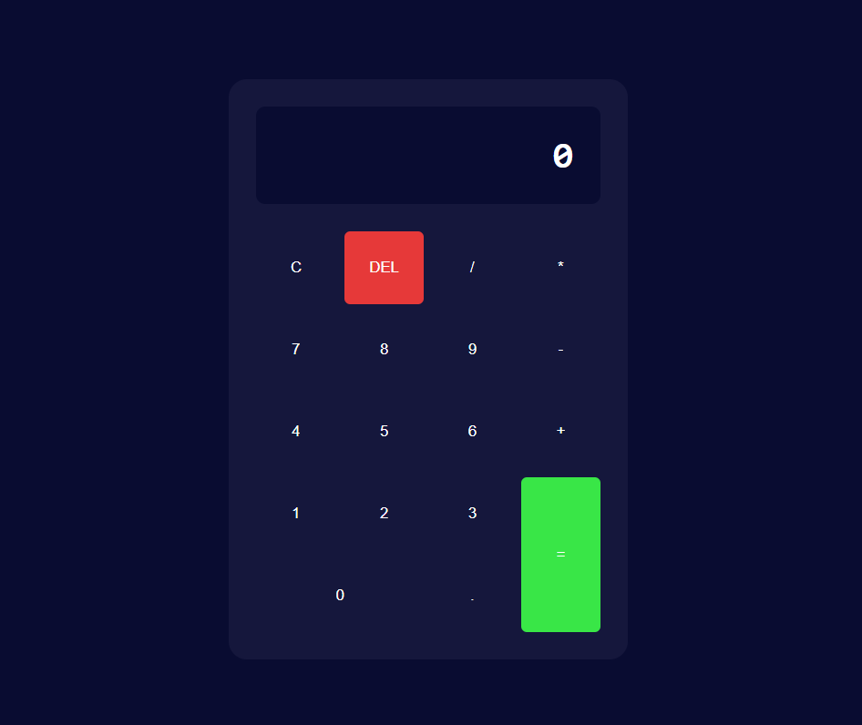

# Calculadora Simple

Este proyecto consiste en una calculadora simple creada utilizando HTML, CSS y JavaScript. Es una excelente manera de practicar y mejorar habilidades básicas de desarrollo web, incluyendo la manipulación del DOM y el uso de eventos en JavaScript.

## Descripción del Proyecto

Este es un ejercicio que realicé para practicar HTML, CSS y JavaScript. La calculadora permite realizar operaciones aritméticas básicas como suma, resta, multiplicación y división.

## Imagen del Ejercicio

## Enlace a la Demo

Puedes ver la calculadora en vivo en el siguiente enlace:

[Ver la Calculadora]( https://greg0910.github.io/Mi_Primera_Calculadora/)
